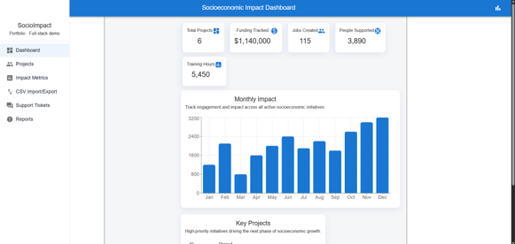
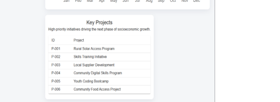
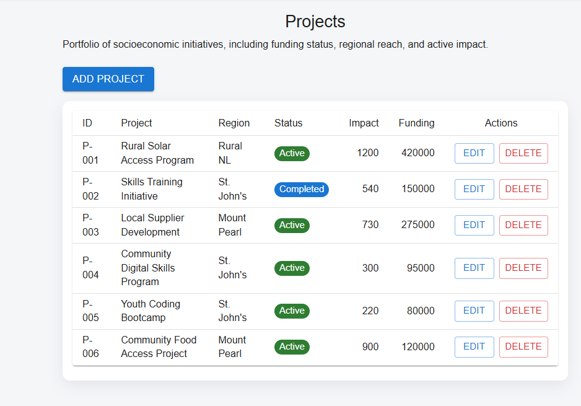
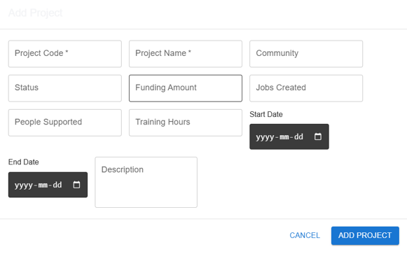
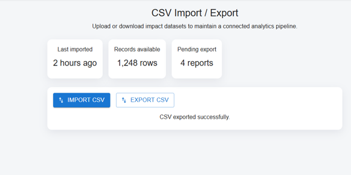
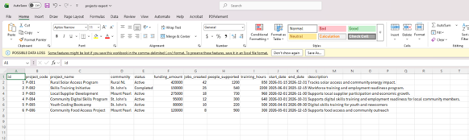

# SocioImpact: Socioeconomic Impact Dashboard

**Full-Stack Portfolio Project Documentation / README**

| Project Type | Full-stack web application |
|---|---|
| Tech Stack | React, Material UI, Node.js, Express.js, Microsoft SQL Server, Axios, Recharts, CSV Import/Export |
| Purpose | Track community projects, funding, jobs created, people supported, training hours, and socioeconomic impact metrics |
| Status | Working local prototype with live SQL Server data and CSV import/export |

---

## 1. Project Overview

SocioImpact is a full-stack socioeconomic impact tracking dashboard built to demonstrate practical product development, database integration, data import/export workflows, and user-focused reporting.

The application allows organizations to manage community initiatives and track measurable outcomes such as funding, jobs created, people supported, training hours, regional reach, and project status.

This project was designed as a portfolio application for software/product companies that build data-driven tools for measuring organizational and community impact. It demonstrates React frontend development, Node.js/Express API development, SQL Server database integration, CRUD operations, dashboard analytics, and CSV processing.

---

## 2. Key Features

- **Dashboard analytics:** Displays live project totals, funding tracked, jobs created, people supported, training hours, and monthly impact charts.
- **Project management:** Users can view, add, edit, and delete socioeconomic impact projects.
- **SQL Server integration:** Project data is stored and retrieved from a Microsoft SQL Server database.
- **CSV import:** Users can upload CSV files containing project data and import multiple records into SQL Server.
- **CSV export:** Users can export all project records from SQL Server into a downloadable CSV file.
- **Impact reporting pages:** Includes pages for impact metrics, reports, support tickets, and CSV workflows.
- **Responsive UI:** Built with Material UI components for a clean, professional dashboard interface.

---

## 3. Tech Stack

| Layer | Tools / Technologies |
|---|---|
| Frontend | React, JavaScript, Material UI, Recharts, Axios |
| Backend | Node.js, Express.js, CORS, dotenv |
| Database | Microsoft SQL Server 2022 Developer Edition, SQL Server Management Studio |
| CSV Processing | multer, csv-parser, json2csv |
| Development Tools | VS Code, Git, GitHub Desktop, npm |

---

## 4. Application Architecture

The application follows a simple three-layer architecture:

```text
React Frontend (localhost:5173)
        |
        | Axios HTTP Requests
        v
Node.js / Express API (localhost:5000)
        |
        | mssql package
        v
Microsoft SQL Server Database
```

**Database:** `socioeconomic_impact_db`  
**Main Table:** `Projects`

---

## 5. Database Design

Main database used in this project:

**Database:** `socioeconomic_impact_db`  
**Main Table:** `Projects`

| Field | Purpose | Example |
|---|---|---|
| id | Unique project ID | 1 |
| project_code | Readable project code | P-001 |
| project_name | Project title | Rural Solar Access Program |
| community | Community or region | St. John's |
| status | Project status | Active |
| funding_amount | Funding tracked | 420000 |
| jobs_created | Jobs created through the project | 42 |
| people_supported | People impacted or supported | 1200 |
| training_hours | Training hours delivered | 850 |
| start_date | Project start date | 2026-01-15 |
| end_date | Project end date | 2026-12-31 |
| description | Project summary | Tracks community energy impact |
| created_at | Record creation timestamp | Auto-generated |

---

## 6. API Endpoints

| Method | Endpoint | Purpose | Status |
|---|---|---|---|
| GET | `/api/health` | Check backend server health | Working |
| GET | `/api/projects` | Fetch all projects from SQL Server | Working |
| POST | `/api/projects` | Add a new project | Working |
| PUT | `/api/projects/:id` | Update an existing project | Working |
| DELETE | `/api/projects/:id` | Delete a project | Working |
| POST | `/api/projects/import-csv` | Import projects from CSV file | Working |
| GET | `/api/projects/export-csv` | Export projects as CSV file | Working |

---

## 7. Local Setup Instructions

### Prerequisites

- Node.js and npm
- Git
- Microsoft SQL Server Developer or Express
- SQL Server Management Studio
- VS Code

### Clone the repository

```bash
git clone https://github.com/syedmaazanwer/socioeconomic-impact-dashboard.git
cd socioeconomic-impact-dashboard
```

### Install and run backend

```bash
cd backend
npm install
npm run dev
```

Backend runs on:

```text
http://localhost:5000
```

### Install and run frontend

Open a second terminal:

```bash
cd frontend
npm install
npm run dev
```

Frontend runs on:

```text
http://localhost:5173
```

---

## 8. Environment Variables

Create a `.env` file inside the `backend` folder.

Example for local development:

```env
PORT=5000
DB_SERVER=localhost
DB_NAME=socioeconomic_impact_db
DB_USER=impact_app
DB_PASSWORD=your_local_password
DB_PORT=1433
```


---

## 9. CSV Import Format

CSV files should follow this header structure:

```csv
project_code,project_name,community,status,funding_amount,jobs_created,people_supported,training_hours,start_date,end_date,description
P-005,Youth Coding Bootcamp,St. John's,Active,80000,10,220,500,2026-04-01,2026-09-30,Digital skills training for youth and newcomers
```

---

## 10. Screenshots

### 10.1 Dashboard Page





**Figure 1.** Dashboard showing live totals, key projects, and monthly impact chart.

### 10.2 Projects Page



**Figure 2.** Projects table showing records from SQL Server with add/edit/delete functionality.

### 10.3 Add Project Dialog



**Figure 3.** Material UI form used to add new project records.

### 10.4 CSV Import/Export Page



**Figure 4.** CSV workflow page for importing and exporting project datasets.

### 10.5 Exported CSV File



**Figure 5.** Exported CSV opened in Microsoft Excel showing project records from SQL Server.

---

## 11. Why This Project Is Relevant

This project is relevant for full-stack developer and product software roles because it demonstrates the ability to build a database-driven application with real product features.

It directly covers full-stack development, React UI design, Node.js API development, SQL Server integration, CRUD operations, data import/export workflows, user support concepts, reporting, documentation, and agile-style feature building.

The project is especially relevant for companies building impact tracking, analytics, reporting, and data-driven software platforms.

---

## 12. Future Improvements

- Add user authentication and role-based access control.
- Add advanced filtering and search for project records.
- Add Power BI dashboard integration or downloadable PDF reports.
- Add unit tests and API tests.
- Deploy frontend and backend to cloud hosting.
- Add audit logs for project changes and CSV imports.

---

## 13. Author

**Syed Maaz Anwer**  
Master of Applied Science in Computer Engineering  
Memorial University of Newfoundland and Labrador  
GitHub: [syedmaazanwer](https://github.com/syedmaazanwer)